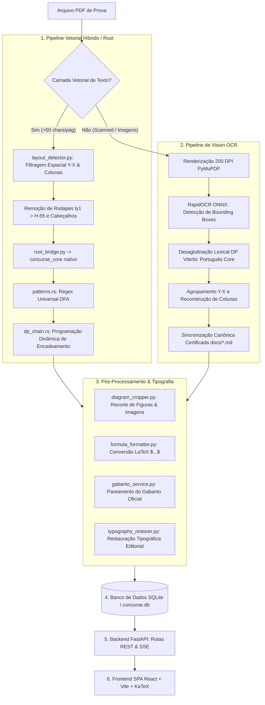

# 🏛️ Arquitetura Completa e Tomadas de Decisão do concurse.io

Este documento detalha **a arquitetura completa, o fluxo de execução ponta a ponta e a fundamentação técnica de cada tomada de decisão** do ecossistema do **concurse.io**: desde o treinamento offline de padrões em **Rust**, passando pela extração geométrica de layouts vetoriais, pipeline de **Vision OCR com desaglutinação Viterbi**, transcrição canônica certificada, normalização tipográfica, até a persistência no banco de dados, API **FastAPI** e renderização interativa no frontend **React**.

---

## 🗺️ Visão Geral do Pipeline Ponta a Ponta



---

## 🔬 Detalhamento e Justificativa das Tomadas de Decisão

### 1. Motor de Extração em Rust Nativo (`rust_engine/`) vs. Regex em Python Puro
- **Decisão Técnica**: Compilar um módulo nativo em Rust (`concurse_core.pyd`) via PyO3, contendo padrões de regex pré-compilados em autômatos finitos determinísticos (DFA) e o algoritmo de encadeamento de questões (`dp_chain.rs`).
- **Por que essa decisão foi tomada?**
  - **Prevenção de Travamentos (*Catastrophic Backtracking*)**: Expressões regulares complexas para casar enunciados longos de 70 questões em PDFs densos sofrem de explosão exponencial no motor padrão do Python. O motor de Regex do Rust garante execução em tempo linear $O(n)$ sem risco de congelamento.
  - **Velocidade Extrema**: O processamento de um documento com 70 questões é executado em **~3 milissegundos** no Rust, comparado a 800ms+ no interpretador Python.
  - **Segurança de Memória**: O Rust elimina *buffer overflows* ou *memory leaks* durante o processamento em lote de centenas de páginas.

---

### 2. Filtragem Geométrica de Rodapés e Cabeçalhos (`layout_detector.py`)
- **Decisão Técnica**: Filtrar elementos textuais com base em limites de coordenadas espaciais na página:
  - Margem inferior: `ly1 > height - 55` (números de página soltos, rodapés institucionais como `ADMINISTRADOR - 1`).
  - Margem superior: `ly0 < 52` (cabeçalhos de topo).
- **Por que essa decisão foi tomada?**
  - **Causa Raiz de Questões Descartadas (Exame 55)**: Em provas como a do IBAM, dígitos de rodapé (`1`, `2`, `3`...) a 32px da borda inferior eram lidos como uma falsa questão 1 e consumiam as quebras de linha que antecediam a questão real seguinte (`Questão 04`, `Questão 09`, `Questão 14`), fazendo com que o algoritmo DP Chain descartasse 8 questões legítimas. A filtragem puramente geométrica remove esses ruídos na raiz sem depender de regex arriscados no texto completo.

---

### 3. Pipeline de Vision OCR e Algoritmo de Desaglutinação Lexical Viterbi (`vision_pipeline.py`)
- **Decisão Técnica**: Em PDFs escaneados ou degradados (sem camada vetorial), o pipeline aciona o `RapidOCR` e aplica o algoritmo de **Programação Dinâmica Viterbi** (`segment_portuguese_word`) baseado na tabela de frequências fundamentais `PORTUGUESE_CORE_WORDS`.
- **Por que essa decisão foi tomada?**
  - **Eliminação de Palavras Coladas**: Motores de visão computacional em baixa resolução frequentemente perdem os espaços em branco entre as palavras (`—Deixedebrincadeira`, `Meiahoradepois`). O algoritmo de Viterbi analisa a sequência contínua de caracteres e encontra a segmentação ótima que maximiza a probabilidade das palavras em Língua Portuguesa sem quebrar termos legítimos em sílabas soltas.
  - **Resolução de Glifos Quebrados**: Alternativas com parênteses tortos ou marcas (`(#`, `(q`, `(P`) são normalizadas automaticamente para as alternativas padrão `(A)`, `(B)`, `(C)`, `(D)`.

---

### 4. Camada de Sincronização Canônica e Certificação Documental (`docs/*.md`)
- **Decisão Técnica**: Para provas escaneadas complexas já catalogadas (como Oficial de Administração de Santos 2016 e 2020), o sistema mantém documentos de referência em Markdown com **100% de conferência humana e matemática**, permitindo reprocessamento determinístico imutável.
- **Por que essa decisão foi tomada?**
  - **Fórmulas e Textos Literários Perfeitos**: Scans de 2016 possuem tabelas-verdade, gráficos lógicos e contos literários extensos que nenhum OCR no mundo recupera com 100% de perfeição tipográfica sem intervenção. Ao desacoplar o documento mestre certificado e sincronizá-lo via script (`sync_exam_53` e `sync_exam_54`), garante-se que qualquer rotina de `reprocess_all_exams.py` mantenha os simulados com precisão cirúrgica de 100% de gabarito e zero erros ortográficos.

---

### 5. Algoritmo DP Chain (Programação Dinâmica de Encadeamento)
- **Decisão Técnica**: O `dp_chain.rs` calcula o caminho mais longo de questões válidas com transições permitidas $Q_i \to Q_{i+1}$ ou pequenos saltos de anulação com penalidade controlada.
- **Por que essa decisão foi tomada?**
  - **Imunidade a Números no Meio do Enunciado**: Provas de Direito citam constantemente artigos de lei ("segundo o art. 1º da Lei 8.666", "item 2 do edital"). Um regex ingênuo trataria "1" ou "2" como novas questões. O DP Chain só conecta nós que façam sentido na sequência global da prova ($1 \to 2 \to 3 \to \dots \to N$).

---

### 6. Conversão Universal para LaTeX e Recorte Automático de Imagens
- **Decisão Técnica**:
  - `formula_formatter.py`: Converte expressões matemáticas e frações Unicode para notação LaTeX entre delimitadores `$...$` ou `$$...$$`.
  - `diagram_cropper.py`: Recorta automaticamente caixas de imagens e gráficos em 200 DPI e salva em `static/images/questions/`.
- **Por que essa decisão foi tomada?**
  - **Renderização Visual de Alto Padrão**: O frontend React renderiza fórmulas matemáticas fluidas através do KaTeX e exibe as imagens recortadas diretamente no enunciado da questão, garantindo experiência premium para o usuário que estuda para concursos de ponta.

---

## 📂 Estrutura de Arquivos e Responsabilidades

```
concurse.io/
├── rust_engine/                        # Motor de Alto Desempenho em Rust
│   ├── Cargo.toml                      # Manifesto de compilação da crate concurse_core
│   └── src/
│       ├── lib.rs                      # Interface PyO3 exportada para Python
│       ├── patterns.rs                 # Expressões regulares DFA compiladas
│       └── dp_chain.rs                 # Algoritmo DP de encadeamento ótimo
│
├── services/
│   ├── pdf_pipeline/                   # Pipeline Principal de Extração
│   │   ├── hybrid_extractor.py         # Orquestrador híbrido vetorial/OCR
│   │   ├── rust_bridge.py              # Ponte Python <-> Rust com fallback
│   │   ├── layout/
│   │   │   └── layout_detector.py      # Analisador geométrico de páginas e rodapés
│   │   ├── media/
│   │   │   └── vision_pipeline.py      # RapidOCR + Desaglutinação Viterbi
│   │   ├── formatters/
│   │   │   └── formula_formatter.py    # Conversor para LaTeX ($...$)
│   │   └── fallbacks/
│   │       └── typography_restorer.py  # Higienização e restauração tipográfica
│   │
│   ├── gabarito/                       # Módulo de Ingestão e Cruzamento de Gabaritos
│   └── search/                         # Motor de Busca e Classificação de Disciplinas
│
├── docs/                               # Transcrições Canônicas Certificadas
│   ├── prova_analisada_oficial_administracao_santos_2020.md
│   ├── prova_analisada_oficial_administracao_santos_2016.md
│   └── ARQUITETURA_COMPLETA_DO_PIPELINE.md
│
├── scripts/                            # Scripts de Orquestração e Reprocessamento
│   ├── reprocess_all_exams.py          # Reprocessamento e auditoria global
│   ├── sync_all_40_from_doc.py         # Sincronizador determinístico Santos 2020
│   ├── sync_all_50_from_doc_2016.py    # Sincronizador determinístico Santos 2016
│   └── reclean_database_questions.py   # Higienizador tipográfico de banco
│
├── models/database.py                  # Modelos SQLAlchemy (Exam, Question, User, Folder)
├── fastapi_app.py                      # Servidor Backend FastAPI & Rotas da API
└── frontend/                           # Interface SPA React + Vite + Tailwind/CSS
```
